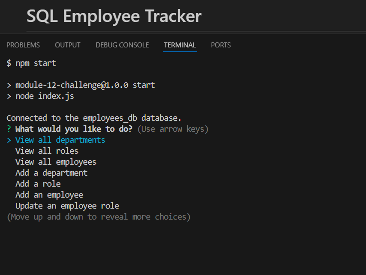

# SQL Employee Tracker

## Description

I wanted to build a command-line application designed to help businesses efficiently manage their employee records, roles, and departments. This application is important for businesses seeking to manage their workforce data. 

Building this project helped me understand how to utilize node.js and postgresSQL better. It also gave me more practice with using the inquirer library.

## Table of Contents

- [Installation](#installation)
- [Usage](#usage)
- [Credits](#credits)
- [License](#license)

## Installation

Use npm i to download the dependencies.

## Usage

To use my node application: 

- You first have to input "node index.js" or "npm start" in the terminal to run it. 
- You will then be prompted with a list of options that you can choose from to achieve your desired task. 
- You can view the department, roles, and employee tables, as well as add to them or delete from them.

<a href="https://drive.google.com/file/d/1OeFMc38TWUbGLgw3EHncJFkzVX6WVtQf/view">How to Use</a> 

## Credits

<a href="https://www.npmjs.com/package/inquirer/v/8.2.4">Inquirer npm</a> 

<a href="https://www.npmjs.com/package/pg">pg npm</a> 

<a href="https://gist.github.com/lukas-h/2a5d00690736b4c3a7ba">License Page</a> 

## License

